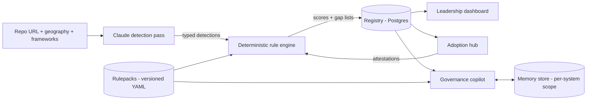

# Leah - Enterprise AI Governance Platform

Product Requirements Document
Version: 0.1 (draft for team merge)
Date: 2026-07-21
Origin: Context Engineering Workshop, Track 2 (Institutional Memory)

## Problem Statement

Enterprises want to adopt AI at scale, but the executives accountable for that adoption cannot confidently answer the question that gates every deployment: "Is this AI system compliant for the jurisdictions we operate in?"

Today that answer is assembled manually. Someone inventories what AI a system actually uses, reads the applicable frameworks, maps obligations to components, and tracks a lengthy regulator-documentation process per system. The work is slow, unrepeatable, and invisible to leadership. The result is stalled adoption: CTOs decline to approve systems they cannot assess.

Leah (Large Enterprise AI) is a single-enterprise governance platform that automates the inventory, makes compliance scoring reproducible, tracks every AI system through its adoption lifecycle, and answers governance questions through an agent that gets sharper the longer the organization uses it.

## Users

| User | Primary surface | Needs |
|------|----------------|-------|
| CTO / executive sponsor | Leadership dashboard | Overall governance posture, risk distribution, adoption pipeline status |
| Governance / compliance lead | Scanner, adoption hub | Run scans, work gap lists, track regulator-documentation status per system. The primary daily user. |
| Engineering teams | Scanner results, adoption hub | Submit repos for scanning, see their systems' gaps and lifecycle status |
| All of the above | Governance copilot | Ask questions in natural language, get answers grounded in registry records |

## Delivery Model

Single-enterprise deployment: each customer runs their own instance (self-hosted or private cloud). There is one tenant per deployment. All data - scans, registry, memory stores - belongs to that enterprise and stays inside its boundary.

## Scope

v1 ships all four subsystems below. Each subsystem's acceptance criteria are the definition of done. Anything not listed in this section or explicitly required by it is in the Cut List.

### 1. Framework Layer (rulepacks)

Compliance frameworks are versioned data, not code.

- Ships with exactly three rulepacks: EU AI Act, NIST AI RMF, ISO/IEC 42001.
- A rulepack is a set of YAML files defining obligations. Each obligation carries: an identifier, source citation, scope (`repo` or `org`), applicability conditions (for example EU AI Act risk-tier logic), and the detection types or registry facts that satisfy or violate it.
- ISO 42001 obligations are predominantly `org`-scoped and are assessed against adoption-hub records (attestations, registry completeness), not repo scans.
- Rulepacks are versioned. A rulepack update never mutates historical scores; it triggers rescoring that produces new score records.
- Rulepacks are updatable without application code changes.

Acceptance criteria:

- Loading a rulepack validates it against a published schema; invalid rulepacks are rejected with actionable errors.
- Each of the three rulepacks covers its framework's core obligations with source citations (EU AI Act: articles; NIST AI RMF: functions and categories; ISO 42001: clauses).
- A scored system can display, per obligation, the citation and the evidence (detections or registry facts) behind its status.

### 2. Scanner and Scoring Engine

Input: a Git repository URL, a geography selection, and one or more frameworks. Output: an AI usage inventory, a compliance score per framework, and a gap list.

The pipeline has two stages with a hard boundary between them:

1. **Detection (Claude-powered).** A Claude pass over the repository produces typed detections of AI usage: model and provider dependencies, inference API calls, prompt assets, agent definitions, fine-tuning or training code, AI-relevant configuration. Every detection carries: type, file locations, confidence, and extracted attributes (for example provider, model identifier). Detections conform to a published schema.
2. **Scoring (deterministic).** A rule engine maps the detection set against the selected rulepacks' `repo`-scoped obligations and computes, per framework: an applicability determination (which obligations apply and why), a status per applicable obligation (satisfied, gap, needs-human-input), a numeric score, and a gap list. The score is the percentage of applicable obligations with status satisfied; obligations in needs-human-input count as unsatisfied until resolved. No LLM participates in scoring.

Reproducibility is a hard requirement: identical repository content plus identical rulepack version plus identical detection set produces an identical score. Every score record stores its full inputs (repo commit SHA, rulepack versions, detection set) for audit.

Scan lifecycle:

- A completed scan creates or updates the system's registry record.
- Rescans are triggered by repository change (new commit SHA at scan time) or rulepack version change. Asking the copilot about a system never triggers a rescan.

Acceptance criteria:

- Scanning a seeded test repository yields the expected detection inventory and the expected deterministic score.
- Two scans of the same commit with the same rulepack versions produce byte-identical score records (modulo timestamps and identifiers).
- Unreachable or unauthorized repositories fail the scan with a visible reason; no score is recorded.
- If the detection stage completes partially (for example a file subset could not be analyzed), the score record is marked `incomplete` and lists what was not covered. Incomplete scores are visually distinct everywhere they appear.

### 3. Adoption Hub

The AI system registry and lifecycle tracker.

- Every scanned system has a registry record: name, owner, use case description, geography, linked repository, latest score per framework, lifecycle status.
- Lifecycle states: proposed, scanned, documented, submitted, approved, live. Transitions are manual (a human moves a system forward) except proposed to scanned, which the first completed scan performs.
- Org-level attestations: a structured checklist derived from `org`-scoped obligations (primarily ISO 42001). A governance lead records attestation status with free-text evidence references. Attestations feed org-scoped scoring.
- Regulator-documentation tracking: per system, a checklist of required documents (defined per framework in the rulepack) with status (missing, drafted, submitted, accepted) and free-text references. Leah tracks status; it does not generate or store the documents themselves.

Acceptance criteria:

- A governance lead can take a system from proposed to live, with every transition and attestation change recorded in an audit log (who, what, when).
- The registry answers "what AI systems do we have, where, at what lifecycle stage, with what posture" in one view.
- ISO 42001 scoring visibly changes when attestations change.

### 4. Leadership Dashboard

Read-only views over the registry for the executive audience.

- Overall governance posture: aggregate score per framework across all registered systems.
- Risk distribution: systems by EU AI Act risk tier and by score band.
- Adoption pipeline: systems by lifecycle stage.
- Trend: posture over time, derived from historical score records.
- Every aggregate drills down to the underlying systems and their score records.

Acceptance criteria:

- The dashboard renders entirely from registry and score data; it performs no scans and no LLM calls.
- A CTO can answer "what is our current exposure and what is in the pipeline" from the landing view without training.

### 5. Governance Copilot (institutional memory agent)

A conversational agent, built on Claude Managed Agents with the Memory tool, that answers governance questions grounded in the registry and rulepacks.

- Example questions: "Can we ship system X in the EU?", "What is blocking system Y from approval?", "Which of our systems would be high-risk under the EU AI Act?"
- Answers cite registry records and rulepack obligations. The copilot never computes or invents scores; it reports what the scoring engine recorded, and says so when no record exists.
- Memory is scoped per AI system via metadata keys. Facts learned about one system do not appear in answers about another.
- Explicit memory policy in the system prompt: always remember distilled system facts, determinations, and stated organizational preferences; never remember credentials, personal data, or raw document content.
- Contradiction handling: when new scan data or user statements contradict stored memory, the copilot flags the contradiction and asks which to trust. It never silently overwrites.
- Session-over-session improvement is a tested behavior, not an aspiration: the same question asked before and after a material registry change must produce a measurably better answer (see Correctness and Evals).

Acceptance criteria:

- Copilot answers include citations resolvable to registry records or rulepack obligations.
- Cross-system memory isolation is verified by test: facts seeded for system A do not surface in answers about system B.
- The contradiction test (deliberately conflicting round of data) results in flag-and-ask behavior.

## Architecture

Deterministic core, agent surface.

Component boundaries:

- **Rulepack engine**: pure functions from (detections, attestations, rulepack version) to score records. No I/O beyond loading rulepacks.
- **Detection service**: wraps the Claude detection pass; owns repo fetching, chunking, and the detection schema. The only component that reads repository content.
- **Registry**: Postgres. System records, score records (append-only), attestations, lifecycle transitions, audit log.
- **Web application**: dashboard and adoption hub UI; thin over the registry.
- **Copilot service**: Managed Agent configuration, memory policy, per-system memory scoping. Reads registry and rulepacks through the same query layer as the web application.

Technology commitments: Claude API (detection pass and copilot; current Claude 5 family models), Claude Managed Agents + Memory tool (copilot), Postgres (registry), YAML rulepacks validated by JSON Schema. Web framework is an implementation-plan decision, not a PRD commitment.

## Data Model (core entities)

- **System**: id, name, owner, use case, geography, repo URL, lifecycle status.
- **Scan**: id, system id, repo commit SHA, rulepack versions, detection set (JSON, schema-versioned), status (complete or incomplete with coverage notes), timestamps.
- **ScoreRecord**: id, scan id, framework, applicable obligations with per-obligation status and evidence references, numeric score, append-only.
- **Attestation**: id, obligation id, status, evidence reference, author, timestamp.
- **LifecycleEvent / AuditEntry**: system id, actor, transition or change, timestamp.
- **RegulatorDocument**: system id, framework, document type, status, reference.

## Correctness and Evals

Priority ordering: types over tests, schemas over conventions, compilation over runtime.

- **Schemas everywhere**: detections, rulepacks, score records, and copilot citations all validate against published schemas at their boundaries.
- **Detection eval suite**: a set of seeded repositories with known AI usage, with measured precision and recall for the detection pass. The suite runs in CI; a detection-quality regression fails the build. Detection quality is the product's honesty and receives the eval investment.
- **Scoring engine**: property-based and example-based unit tests; the reproducibility guarantee is itself a test (same inputs, identical output).
- **Copilot evals**: the two-session sharpness test (same question, materially changed registry, graded improvement), the memory-isolation test, and the contradiction flag-and-ask test, automated against a seeded instance.
- **Error handling principle**: nothing silent. Failed scans are visible failures. Partial coverage is labeled. Missing data in copilot answers is stated as missing.

## Cut List

The following are out of scope for v1. They are cut, not deferred; none carries an implied commitment.

- Multi-tenant SaaS delivery and cross-tenant isolation
- Code-level risk analysis (PII flow tracing, guardrail auditing, permission analysis)
- Evidence and documentation auditing (checking for model cards, risk assessments, oversight docs inside repos)
- Always-on repository monitoring and scheduled scan triggers
- Generation or storage of regulator submission documents
- Frameworks beyond EU AI Act, NIST AI RMF, and ISO/IEC 42001
- Non-Git or non-URL-addressable code sources
- Fine-grained RBAC (v1 has two roles: read-only viewer and governance editor)

## Success Criteria

v1 is successful when, on a real enterprise deployment:

1. A governance lead can register a repository, run a scan, and present the resulting score and gap list to a framework-literate reviewer who accepts the applicability determinations as correct.
2. The CTO answers "what is our AI exposure and adoption pipeline status" from the dashboard alone.
3. The copilot demonstrably improves: the flagship demo (same governance question before and after a registry change, visibly sharper and correctly cited answer) passes live.
4. An auditor, given a score record, can independently re-derive the score from its stored inputs and the cited rulepack version.
